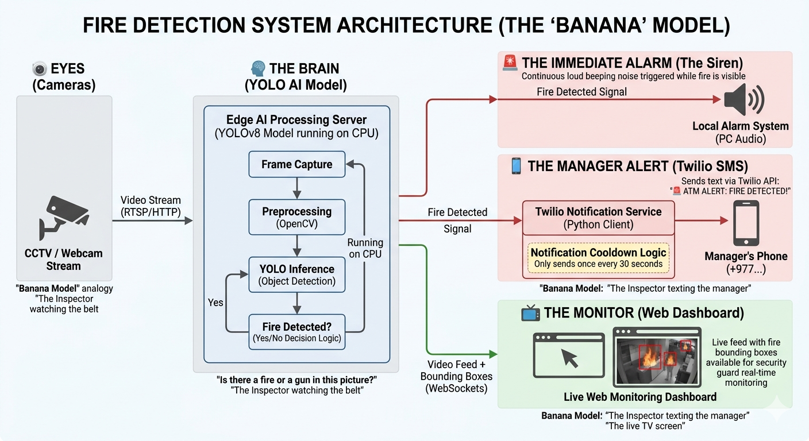
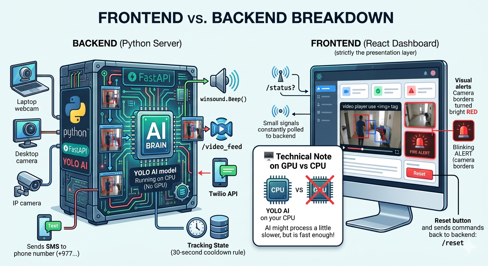

# 🔥 Advanced ATM Fire Detection System

> **Final Capstone Project — Data Science with Machine Learning Course**
> **Deerwalk Training Center, Kathmandu, Nepal**

---

## 📌 Project Overview

This project is the **capstone/final project** of the _Data Science with Machine Learning_ course at **Deerwalk Training Center**. It demonstrates a real-world, production-ready intelligent surveillance system that uses a fine-tuned **YOLOv8 deep learning model** to detect fire (and weapons) inside ATM booths and secured premises — in real time — across multiple camera feeds simultaneously.

The system streams live webcam footage through a **FastAPI** backend, performs **frame-by-frame object detection on every captured image**, and immediately:

- Triggers a **visual alarm** (red pulsing border) in the browser dashboard
- Plays an **audio siren** inside the browser
- Fires a **Windows OS-level audio beep** from the server
- Sends an **SMS alert via Twilio** to the security officer's phone
- Logs every security event in a live **activity log** sidebar

This project integrates the full data science and machine learning pipeline — from model training and evaluation to real-time deployment with a professional-grade user interface.

---

## 🖼️ Application Screenshots

The following images were **AI-generated by Google Gemini** to illustrate the concept and interface design of this fire detection dashboard before the UI was built:

### Dashboard Design — Normal State



> **Image Description:** This Gemini-generated image showcases the intended dashboard layout in its **normal / all-clear state**. The interface features a dark, high-contrast design inspired by professional security consoles. Multiple camera feed panels are displayed in a responsive grid layout, each showing a live video thumbnail with a camera name label, an online/offline indicator (WiFi icon), and a green **SAFE** badge in the bottom-left corner of each feed. The header area contains the application title _"Advanced Fire Detection System — High-Security Surveillance Console v2.0"_ along with a status badge reading **"All Systems Normal"** in green. A right sidebar shows system telemetry including CPU usage, GPU usage, and network latency meters. The color palette is slate-black with cyan and emerald accents — communicating calm, operational normalcy.

---

### Dashboard Design — Fire Alert State



> **Image Description:** This Gemini-generated image depicts the dashboard in its **active fire alert state**. The entire browser viewport is framed by a **pulsing red border** that blinks continuously to draw immediate attention. A red emergency banner slides in below the header, displaying the message **"🚨 FIRE DETECTED — CALLING EMERGENCY CONTACTS"** with an animated "Dialing 911…" indicator. The camera card where fire was detected switches to a red-bordered tile with a flashing **FIRE** badge and a red overlay flashing across the video feed at 0.7-second intervals. The header status badge transitions from green to red, showing **"Alert Active"** with a siren icon. The System Controls panel on the right shows a bright **Reset Alarm** button in red. This entire state is also accompanied by both a browser audio siren and a Windows `winsound.Beep` alert from the backend server.

---

## 🎯 Key Features

| Feature                           | Description                                                                          |
| --------------------------------- | ------------------------------------------------------------------------------------ |
| 🤖 **YOLOv8 Real-Time Detection** | Custom-trained `fire.pt` model detects Fire and Gun objects at ≥50% confidence       |
| 📹 **Multi-Camera Grid**          | Supports Laptop Camera, Desktop Camera, and Other Camera concurrently                |
| 🔴 **Live Alert UI**              | Animated pulsing red border, emergency banner, and fire badge on the affected camera |
| 🔊 **Dual Siren System**          | Browser audio siren (OGG file) + backend `winsound.Beep` (2500 Hz)                   |
| 📱 **Twilio SMS Alert**           | Sends an SMS to the configured security phone number, with a 30-second cooldown      |
| 🛡️ **Admin Panel**                | Dynamically add, rename, or remove cameras from the live grid                        |
| 📋 **Activity Log**               | Real-time scrollable log of all detection events with timestamps                     |
| ♻️ **Manual Alarm Reset**         | Per-camera reset via REST API to clear the alert state                               |
| 📊 **System Telemetry**           | Live CPU, GPU usage, and API latency shown in sidebar                                |

---

## 🏗️ System Architecture

```
┌──────────────────────────────────────────────────────────────┐
│                     React Frontend (Vite)                    │
│  ┌────────────┐  ┌──────────────┐  ┌──────────────────────┐  │
│  │ CameraGrid │  │  CameraCard  │  │     AdminPanel       │  │
│  │  (grid     │  │ (per-camera  │  │  (add/rename/remove  │  │
│  │   view)    │  │  tile + feed)│  │   cameras)           │  │
│  └────────────┘  └──────────────┘  └──────────────────────┘  │
│  ┌────────────┐  ┌──────────────┐  ┌──────────────────────┐  │
│  │ LiveStream │  │   Controls   │  │      Sidebar         │  │
│  │(single cam │  │ (reset alarm │  │  (CPU/GPU/latency/   │  │
│  │  drill-down│  │  siren toggle│  │   activity log)      │  │
│  └────────────┘  └──────────────┘  └──────────────────────┘  │
│              polls /status every 1s via useFireStatus hook    │
└───────────────────────────┬──────────────────────────────────┘
            HTTP / MJPEG streaming over localhost:8000
┌───────────────────────────▼──────────────────────────────────┐
│                  FastAPI Backend (Python)                     │
│                                                              │
│  ┌──────────────────────────────────────────────────────┐    │
│  │  capture_worker (Thread per camera)                  │    │
│  │   cv2.VideoCapture → YOLOv8 inference → annotate    │    │
│  │   → store latest_frames[cam_type]                   │    │
│  └──────────────────────────────────────────────────────┘    │
│                                                              │
│  ┌──────────────────────────────────────────────────────┐    │
│  │  siren_worker (Daemon Thread)                        │    │
│  │   checks camera_fire_timestamps → winsound.Beep     │    │
│  └──────────────────────────────────────────────────────┘    │
│                                                              │
│  REST Endpoints:                                             │
│   GET  /video_feed?cam=...  → MJPEG stream                  │
│   GET  /status?cam=...      → { fire_detected: bool }       │
│   POST /reset?cam=...       → clears alarm state            │
│   POST /test_sms            → sends Twilio test SMS         │
│                                                              │
│  ┌──────────────────────────────────────────────────────┐    │
│  │  Twilio SMS (trigger_security_protocol)              │    │
│  │   Sends "🚨 ADVANCED ALERT: FIRE DETECTED!" SMS     │    │
│  │   Rate-limited: 1 SMS per 30 seconds                │    │
│  └──────────────────────────────────────────────────────┘    │
└──────────────────────────────────────────────────────────────┘
```

---

## 🧠 Machine Learning Details

### Model

- **Architecture:** YOLOv8 (You Only Look Once, version 8) — state-of-the-art real-time object detection
- **Framework:** [Ultralytics](https://github.com/ultralytics/ultralytics) (`ultralytics >= 8.3.0`)
- **Model file:** `backend/fire.pt` (~6.2 MB fine-tuned weights)
- **Inference confidence threshold:** `0.50` (50%) to suppress false positives
- **Target classes detected:** `Fire`, `fire`, `Gun`

### Training Pipeline (Data Science Workflow)

1. **Data Collection** — Gathered labeled fire and weapon images from public datasets
2. **Data Preprocessing** — Resized, normalized, and augmented images (flips, brightness shifts)
3. **Model Fine-tuning** — Fine-tuned a pre-trained YOLOv8 backbone on the custom dataset using transfer learning
4. **Evaluation** — Validated with mAP (mean Average Precision), precision, and recall metrics
5. **Export** — Exported best weights as `fire.pt` for deployment
6. **Deployment** — Loaded directly into FastAPI using `model = YOLO("fire.pt")`

### Inference Flow (Per Frame)

```python
results = model(frame, conf=0.5)          # Run detection
for r in results:
    for box in r.boxes:
        cls   = int(box.cls[0])
        label = model.names[cls]            # "Fire" / "Gun"
        if label in ["Gun", "Fire", "fire"]:
            fire_found_in_frame = True
annotated_frame = results[0].plot()        # Draw bounding boxes
```

---

## 🛠️ Technology Stack

### Backend

| Technology           | Version | Purpose                               |
| -------------------- | ------- | ------------------------------------- |
| Python               | 3.10+   | Core language                         |
| FastAPI              | latest  | REST API + MJPEG streaming server     |
| Uvicorn              | latest  | ASGI server                           |
| Ultralytics (YOLOv8) | ≥ 8.3.0 | Fire/weapon detection model           |
| OpenCV (`cv2`)       | ≥ 4.8.0 | Video capture and frame encoding      |
| Twilio               | latest  | SMS alert delivery                    |
| python-dotenv        | latest  | Environment variable management       |
| winsound             | stdlib  | Windows OS audio beep (siren)         |
| threading            | stdlib  | Non-blocking camera and siren workers |

### Frontend

| Technology    | Version | Purpose                             |
| ------------- | ------- | ----------------------------------- |
| React         | 19.x    | Component-based UI framework        |
| Vite          | 8.x     | Lightning-fast dev server & bundler |
| Tailwind CSS  | 4.x     | Utility-first styling               |
| Framer Motion | 12.x    | Smooth animations & transitions     |
| Lucide React  | latest  | Icon library                        |
| Axios         | 1.x     | HTTP client for API calls           |

---

## 📂 Project Structure

```
fire/
│
├── README.md                          ← This file
├── Gemini_Generated_Image_5mmjex.png  ← AI-generated concept art (normal state)
├── Gemini_Generated_Image_c71kzs.png  ← AI-generated concept art (alert state)
│
├── backend/
│   ├── main.py                        ← FastAPI server, YOLO inference, Twilio SMS
│   ├── fire.pt                        ← Fine-tuned YOLOv8 model weights (~6.2 MB)
│   ├── requirements.txt               ← Python dependencies
│   └── .env                           ← Twilio credentials (NOT committed to Git)
│
└── frontend/
    ├── index.html                     ← HTML entry point
    ├── package.json                   ← Node dependencies
    ├── vite.config.js                 ← Vite + proxy config
    └── src/
        ├── App.jsx                    ← Root component, layout, routing
        ├── index.css                  ← Global styles
        ├── hooks/
        │   ├── useFireStatus.js       ← Polls /status, manages audio & activity log
        │   └── useCameras.js          ← Camera list state management
        └── components/
            ├── LiveStream.jsx         ← Single camera MJPEG  display
            ├── CameraGrid.jsx         ← Multi-camera responsive grid
            ├── CameraCard.jsx         ← Per-camera tile (feed + status badge)
            ├── Controls.jsx           ← Reset alarm + manual siren toggle
            ├── Sidebar.jsx            ← CPU/GPU/latency + activity log
            └── AdminPanel.jsx         ← Dynamic camera provisioning panel
```

---

## ⚙️ Setup & Installation

### Prerequisites

- Python 3.10 or higher
- Node.js 18 or higher
- A webcam connected to your machine
- A [Twilio](https://www.twilio.com/) account (free trial works)

### 1. Clone the Repository

```bash
git clone https://github.com/<your-username>/fire-detection-system.git
cd fire-detection-system
```

### 2. Backend Setup

```bash
cd backend

# Create and activate virtual environment
python -m venv myenv
myenv\Scripts\activate        # Windows

# Install dependencies
pip install -r requirements.txt
```

Create a `.env` file inside the `backend/` folder:

```env
TWILIO_SID=ACxxxxxxxxxxxxxxxxxxxxxxxxxxxxxxxx
TWILIO_AUTH_TOKEN=your_auth_token_here
TWILIO_PHONE=+1XXXXXXXXXX
USER_PHONE=+977XXXXXXXXXX
```

Start the backend server:

```bash
python main.py
# Server runs at http://localhost:8000
```

### 3. Frontend Setup

```bash
cd frontend

# Install Node dependencies
npm install

# Start the development server
npm run dev
# App runs at http://localhost:5173
```

Open your browser and go to **http://localhost:5173**

---

## 🌐 API Reference

| Method | Endpoint                        | Description                                     |
| ------ | ------------------------------- | ----------------------------------------------- |
| `GET`  | `/video_feed?cam=Laptop Camera` | Live MJPEG video stream with bounding boxes     |
| `GET`  | `/status?cam=Laptop Camera`     | Returns `{ "fire_detected": true/false }`       |
| `POST` | `/reset?cam=Laptop Camera`      | Resets the fire alarm state for that camera     |
| `POST` | `/test_sms`                     | Sends a test SMS to verify Twilio is configured |

**Example status response:**

```json
{
  "fire_detected": true
}
```

---

## 🚨 Alert System — How It Works

When the YOLO model detects fire or a weapon in any camera frame:

1. **Backend** — Updates `camera_fire_timestamps[cam_type]` with the current Unix timestamp
2. **Backend siren thread** — Continuously checks if any timestamp is < 2 seconds old; if so, plays `winsound.Beep(2500, 1000)`
3. **Twilio SMS** — If the last alert was > 30 seconds ago, launches a background thread to send an SMS
4. **Frontend polling** — `useFireStatus` hook polls `GET /status` every **1 second** per camera
5. **React UI triggers:**
   - Pulsing red `box-shadow` overlay on the entire viewport
   - Red emergency banner slides in with _"🚨 FIRE DETECTED — CALLING EMERGENCY CONTACTS"_
   - Browser audio siren (spaceship alarm OGG) plays in a loop
   - Affected `CameraCard` switches to a red border with a flashing **FIRE** badge
   - Document tab title changes to `🔥 FIRE ALERT — Advanced Security`

To resolve: click **Reset Alarm** → calls `POST /reset` → clears timestamps → all alerts stop automatically within 2 seconds.

---

## 🔒 Environment Variables

| Variable            | Description                                             |
| ------------------- | ------------------------------------------------------- |
| `TWILIO_SID`        | Twilio Account SID from console.twilio.com              |
| `TWILIO_AUTH_TOKEN` | Twilio Auth Token                                       |
| `TWILIO_PHONE`      | Your Twilio virtual phone number (e.g., `+1415xxxxxxx`) |
| `USER_PHONE`        | Destination phone number for SMS alerts                 |

> ⚠️ **Never commit your `.env` file to GitHub.** It is already listed in `.gitignore`.

---

## 🎓 Academic Context

**Institution:** Deerwalk Training Center, Kathmandu, Nepal
**Course:** Data Science with Machine Learning
**Project Type:** Final Capstone Project
**Year:** 2026

### Concepts Demonstrated

- **Supervised Learning** — Object detection with labeled bounding box data
- **Transfer Learning** — Fine-tuning a pre-trained YOLOv8 COCO backbone on a custom fire dataset
- **Computer Vision** — Real-time image classification and localization using CNNs
- **REST API Design** — FastAPI with streaming responses and background tasks
- **Full-Stack Development** — Python backend + React frontend integration
- **Real-Time Systems** — Multi-threaded frame capture, inference pipeline, and alert dispatch
- **Cloud Integration** — Twilio API for programmatic SMS delivery
- **DevOps Basics** — Environment variable management, `.gitignore`, virtual environments

---

## 🤝 Contributing

This is an academic capstone project. If you wish to extend it:

1. Fork the repository
2. Create a feature branch: `git checkout -b feature/new-camera-source`
3. Commit your changes: `git commit -m "Add RTSP camera support"`
4. Push and open a Pull Request

---

## 📄 License

This project is released for educational purposes under the **MIT License**.

---

## 👨‍💻 Author

Developed as a final capstone project at **Amatya**.
Course: _Data Science with Machine Learning_ — 2026.

---

<p align="center">
  Made with 🔥 and 🤖 at Amatya · Kathmandu, Nepal
</p>
